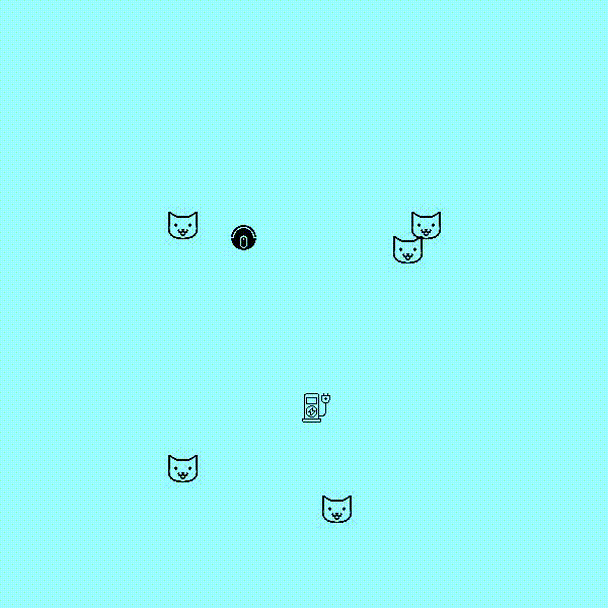
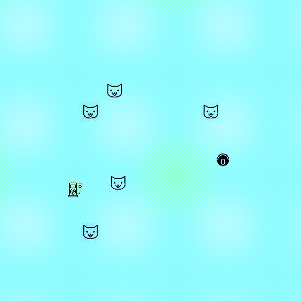
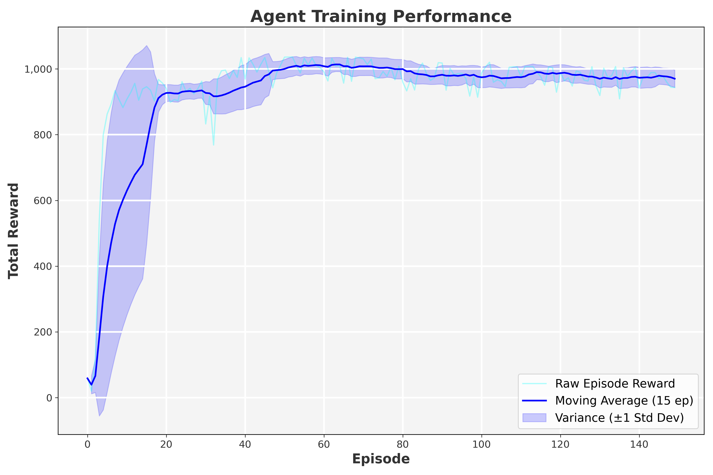
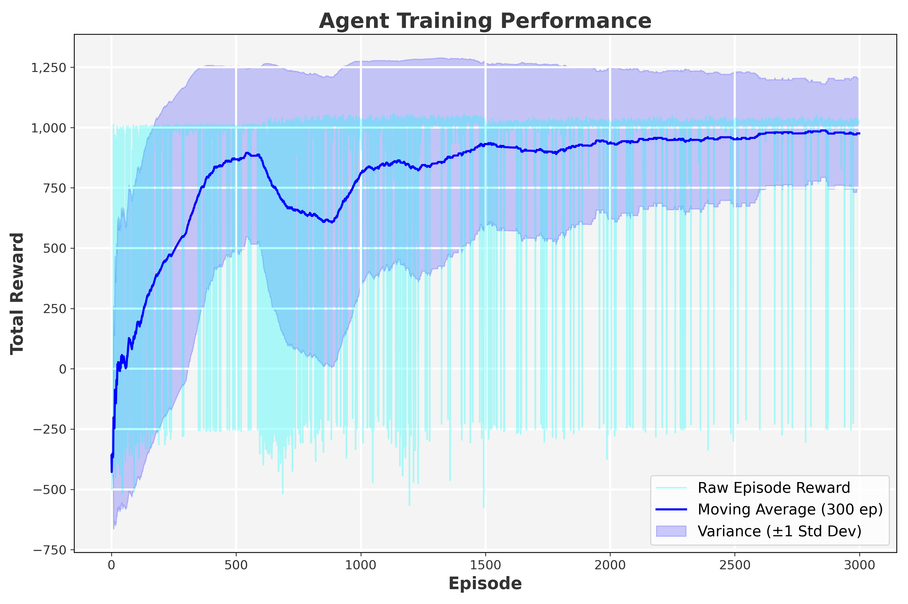

# 🤖 RL Robot Navigation


Deep Reinforcement Learning for 2D robot navigation with dynamic obstacles, curriculum-based training, and simulated LiDAR using custom DQN and PPO agents.

## 🎥 Demonstrations

### PPO Agent vs DQN Agent

| PPO Agent | DQN Agent |
| :---: | :---: |
|  |  |

### Learning Curves
| PPO Training Performance | DQN Training Performance |
| :---: | :---: |
|  |  |

## 🧠 Project Overview
This repository contains a custom continuous-coordinate 2D environment built with the `gymnasium` API and rendered via `pygame`. The goal is to train an autonomous robot to navigate toward a charging station while avoiding walls, static obstacles, and dynamic moving hazards. 

Two Deep RL algorithms were implemented from scratch using TensorFlow:
* **PPO (Proximal Policy Optimization):** Features Generalized Advantage Estimation (GAE), actor-critic architecture, and entropy-based exploration.
* **DQN (Deep Q-Network):** Features Experience Replay and Target Networks with Orthogonal Initialization for stability.

## ✨ Key Features
* **Custom Gymnasium Environment:** Fully compliant with the standard Gym API (`reset`, `step`, `render`).
* **Curriculum Learning:** Training progresses through 3 phases ("Kindergarten", "Middle School", "High School"), gradually increasing the distance to the goal and introducing randomized obstacle spawns.
* **200-Ray LiDAR Simulation:** The robot senses its environment using a vectorized ray-casting system that detects walls and hazards.
* **Dynamic Hazards:** The environment includes static obstacles, bouncing moving creatures, and a challenging "goal-orbiting" creature.
* **Complex Reward Shaping:** Combines sparse terminal rewards (reaching goal, crashing) with dense shaping (distance delta, alignment bonus, and LiDAR-based proportional repulsion fields).

## 📂 Repository Structure
```text
├── docs/
│   ├── imgs/               # Learning curve plots
│   └── videos/             # Agent evaluation GIFs
├── nav2d/
│   ├── assets/             # Pygame sprites (robot, hazards, goal)
│   ├── base_agent.py       # Abstract Base Class for RL agents
│   ├── config.py           # Hyperparameters and Environment settings
│   ├── dqn_agent.py        # DQN Implementation
│   ├── ppo_agent.py        # PPO Implementation
│   ├── elements.py         # Physics and logic for objects/hazards
│   ├── engine.py           # The core Gymnasium Environment
│   └── utils.py            # Video generation, plotting, and math utilities
├── .gitignore              # Ignored files and folders
├── evaluate.py             # Script to load agents and generate evaluation videos
├── LICENSE                 # MIT License
├── README.md               # Project documentation
├── requirements.txt        # Project dependencies
├── train_dqn.py            # Training loop for DQN
└── train_ppo.py            # Training loop for PPO
```

## ⚙️ Installation

1. Clone the repository:
```bash
git clone [https://github.com/yourusername/rl-robot-navigation.git](https://github.com/yourusername/rl-robot-navigation.git)
cd rl-robot-navigation
```

2. Create a virtual environment (optional but recommended):
```bash
python -m venv venv
source venv/bin/activate  # On Windows use `venv\Scripts\activate`
```

3. Install dependencies:
```bash
pip install -r requirements.txt
```

## 🚀 Usage

### 🏋️ Training an Agent
To train an agent from scratch, run the respective training script. The scripts will periodically save model weights (.keras) and generate learning curve plots upon completion.
```bash
python train_ppo.py
# or
python train_dqn.py
```

### 📺 Evaluating and Generating Videos
To evaluate a trained agent, you need the .keras model weights.
(Note: Pre-trained weights are available in the GitHub Releases tab. Download them and place them in the root directory).
Once the weights are in the root folder, run:
```bash
python evaluate.py
```
This will run the agent through several episodes in the hardest difficulty setting and output an .mp4 video of the performance.

## 🗺️ Environment Details
* **Observation Space (Size: 203):**
  * `[0]`: Normalized distance to the goal.
  * `[1, 2]`: Sine and Cosine of the relative angle to the goal.
  * `[3...203]`: 200 normalized LiDAR distance readings.
* **Action Space (Discrete: 4):**
  * `0`: Turn Right
  * `1`: Turn Left
  * `2`: Move Forward
  * `3`: Sprint (2x Speed)

## 📄 License
This project is licensed under the MIT License - see the [LICENSE](LICENSE) file for details.
